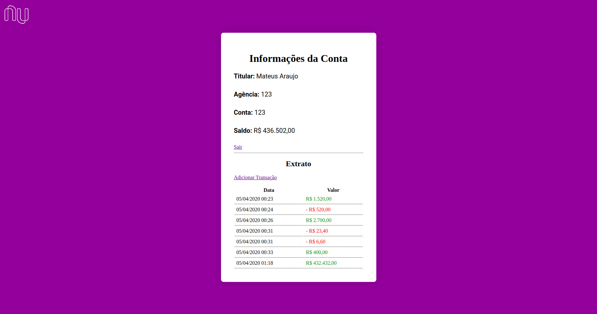

<h1 align="center">Sistema de Controle Bancário</h1>

 🚀 Sistema simples em PHP baseado no Layout do Nubank
 

  

## Features
Para o desenvolvimento do projeto foram utilizadas as seguintes tecnologias:

- **PHP**
- **MYSQL**
- **HTML E CSS**

## Projeto

